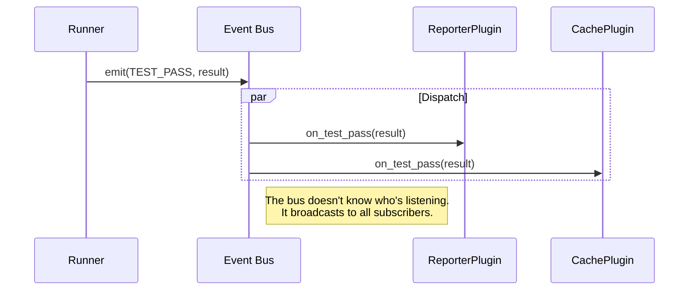

# Plugins

Plugins are **Observers** on the [Event Bus](event-bus.md). They subscribe to lifecycle
events and react to them: reporting results, filtering tests, caching data, or
integrating with external systems.

## Architecture



When the runner emits an event, the bus dispatches it to **all plugins** that
implement the corresponding `on_<event>` handler. A plugin can implement as many
handlers as it needs.

Plugins don't call the bus directly. They simply define handler methods, and the
bus invokes them when relevant events occur.

## PluginBase

All plugins extend `PluginBase`:

```python
from protest.plugin import PluginBase
from protest.entities import TestResult, SessionResult


class MyPlugin(PluginBase):
    name = "my-plugin"
    description = "Does something useful"

    def __init__(self, output_path: str):
        self.output_path = output_path
        self.results: list[TestResult] = []

    def on_test_pass(self, result: TestResult) -> None:
        self.results.append(result)

    def on_session_complete(self, result: SessionResult) -> None:
        with open(self.output_path, "w") as f:
            f.write(f"Passed: {len(self.results)} tests")
```

Handler methods follow the naming convention `on_{event_name}`. See
[Events](events.md) for the complete list of available events and their payloads.

## Sync vs Async Handlers

Handlers can be sync or async. Both avoid blocking the event loop, but they differ
in **whether the bus waits for the handler to complete**.

### Sync Handlers

```python
def on_test_pass(self, result: TestResult) -> None:
    print(f"PASS: {result.name}")
```

Sync handlers run in a **thread pool** (not blocking the loop), but the bus
**awaits their completion** before continuing. Use them when:

- The work is fast (< 10ms)
- Order matters (e.g., printing results sequentially)
- You need the handler to finish before the next one starts

### Async Handlers

```python
async def on_test_pass(self, result: TestResult) -> None:
    await self.http_client.post("/webhook", json=result.to_dict())
```

Async handlers are **fire-and-forget**: the bus schedules them and moves on
immediately. They run concurrently with everything else. Use them when:

- The work is slow (network I/O, database queries)
- You don't need to block the emission pipeline
- Throughput matters more than ordering

The bus tracks pending async handlers and waits for them before `SESSION_COMPLETE`.

### Comparison

| Aspect                 | Sync                     | Async                    |
|------------------------|--------------------------|--------------------------|
| Blocks event loop?     | No (threadpool)          | No                       |
| Blocks event emission? | **Yes** (awaited)        | **No** (fire-and-forget) |
| Execution order        | Sequential per event     | Concurrent               |
| Best for               | Fast ops, console output | Network I/O, slow work   |

## Plugin Activation (Factory Pattern)

Plugins can integrate with the CLI using a **Factory pattern**. The `activate`
class method decides whether to instantiate the plugin based on CLI arguments.

```python
from typing import Self

from protest.plugin import PluginBase, PluginContext


class CTRFPlugin(PluginBase):
    name = "ctrf"
    description = "CTRF JSON reporter"

    def __init__(self, output_path: str):
        self.output_path = output_path

    @classmethod
    def add_cli_options(cls, parser) -> None:
        """Register CLI arguments. Called during CLI setup."""
        group = parser.add_argument_group("CTRF Reporter")
        group.add_argument(
            "--ctrf-output",
            metavar="PATH",
            help="Write CTRF JSON report to PATH",
        )

    @classmethod
    def activate(cls, ctx: PluginContext) -> Self | None:
        """Factory method. Return instance or None to skip activation."""
        output = ctx.get("ctrf_output")
        if not output:
            return None  # User didn't request this plugin
        return cls(output_path=output)
```

### PluginContext

`PluginContext` wraps CLI arguments (from argparse) and programmatic config into
a unified dict-like interface:

```python
@classmethod
def activate(cls, ctx: PluginContext) -> Self | None:
    # Get with default
    verbose = ctx.get("verbose", False)

    # Check presence
    if "output" not in ctx:
        return None

    return cls(output=ctx.get("output"), verbose=verbose)
```

The string keys correspond to argparse destination names (underscored, not
hyphenated: `--my-option` becomes `my_option`).

## Collection Filtering

`on_collection_finish` is special: it's a **pipeline** handler, not a notification.
It receives the collected tests and can filter or reorder them:

```python
def on_collection_finish(self, items: list[TestItem]) -> list[TestItem]:
    # Keep only tests tagged "fast"
    return [item for item in items if "fast" in item.tags]
```

Return `None` or the original list to pass through unchanged. Multiple plugins
can filter; they chain in registration order.

## Setup Hook

`setup()` is called when the plugin is registered, before any events fire:

```python
def setup(self, session: ProTestSession) -> None:
    # Access session configuration
    self.concurrency = session.concurrency

    # Access shared cache (for cross-plugin data)
    self.cache = session.cache
```

## Registering Plugins

### Programmatic

```python
session = ProTestSession()
session.register_plugin(MyPlugin(output="report.json"))
```

### Via CLI

Plugins with `add_cli_options` are auto-discovered. Their options appear in
`--help`, and `activate()` is called with the parsed arguments.

## Best Practices

### Do

- Use `on_session_complete` for final reports (guarantees all async work is done)
- Keep sync handlers fast (< 10ms)
- Use async for any network I/O
- Return `None` from `on_collection_finish` if not filtering

### Don't

- Don't block in sync handlers (no `requests.get()`, use async)
- Don't assume handler order between plugins
- Don't raise exceptions to control flow
- Don't modify shared mutable state across `await` points without synchronization

## Shared Cache Storage

Plugins can share data via `session.cache`, a `CacheStorage` instance. This enables cross-plugin communication without direct coupling.

### Accessing the Cache

```python
from protest.plugin import PluginBase
from protest.entities import TestResult


class MyPlugin(PluginBase):
    name = "my-plugin"

    def setup(self, session) -> None:
        # Read previous run data
        durations = session.cache.get_durations()
        failed = session.cache.get_failed_node_ids()

    def on_test_pass(self, result: TestResult) -> None:
        # Record result
        session.cache.set_result(result.node_id, "passed", result.duration)

    def on_session_end(self, result) -> None:
        # Persist to disk
        session.cache.save()
```

### CacheStorage API

| Method | Returns | Description |
|--------|---------|-------------|
| `load()` | `None` | Load cache from `.protest/cache.json` |
| `save()` | `None` | Persist cache to disk |
| `clear()` | `None` | Delete cache file |
| `get_result(node_id)` | `TestCacheEntry \| None` | Get cached result for a test |
| `set_result(node_id, status, duration)` | `None` | Record a test result |
| `get_results()` | `dict[str, TestCacheEntry]` | All cached results |
| `get_durations()` | `dict[str, float]` | Test durations by node_id |
| `get_failed_node_ids()` | `set[str]` | Node IDs of failed tests |
| `get_passed_node_ids()` | `set[str]` | Node IDs of passed tests |

### Example: Duration-Based Ordering

```python
class FastFirstPlugin(PluginBase):
    """Run fast tests first based on previous durations."""
    name = "fast-first"

    def setup(self, session) -> None:
        session.cache.load()
        self.durations = session.cache.get_durations()

    def on_collection_finish(self, items: list[TestItem]) -> list[TestItem]:
        def sort_key(item):
            return self.durations.get(item.node_id, float("inf"))
        return sorted(items, key=sort_key)
```

## See Also

- [Event Bus](event-bus.md) - How the bus dispatches events
- [Events](events.md) - Complete event reference with payloads
- [Architecture](architecture.md) - Overall system design
